# 🚀 Hello World! I'm Vijeta

<div align="center">


</div>

---


## 👩‍💻 About This Human

```javascript
class Developer {
    constructor() {
        this.name = "Vijeta";
        this.pronouns = "she/her";
        this.location = "Earth (mostly)";
        this.currentRole = "Digital Swiss Army Knife (Engineering Edition)";
        this.workingOn = "Making computers do my bidding";
        this.learning = "How to speak fluent AI";
        this.askMeAbout = ["How I make magic happen with just a keyboard and caffeine",
                            "Why I believe chaos is just unsorted creativity",
                            "What it's like being the team's unofficial therapist and debugger",
                            "The fine art of turning vague ideas into wild prototypes",
                            "How I accidentally broke something… and then fixed everything",
                            "Turning 'Wait, is this even possible?' into 'It’s already live'",
                            "Wearing 5 hats and somehow still asking for a bigger one",
                            "Building things that do things that help other things do things",
                            "My side hustle as a pixel perfectionist and flow architect",
                            "Conversations I’ve had with my rubber duck",
                            "Why my bookmarks are just organized panic",
                            "Fixing things I didn’t break… probably",
                            "Living in the intersection of creativity, chaos, and caffeine",
                            "Why the commit message says 'final-final-REAL-final'",
                          ];
        this.funFact = "I debug with console.log() and I'm not ashamed";
    }
    
    getCurrentStatus() {
        return {
            coffee: "☕".repeat(Math.floor(Math.random() * 5) + 1),
            bugs: Math.floor(Math.random() * 99) + " bugs in the code",
            mood: this.coffee.length > 3 ? "Ready to conquer" : "Send caffeine",
            lifePhilosophy: "Code like a girl - because we're damn good at it! 💪"
        };
    }
}
```

<br clear="right"/>

---

## 🎯 Current Debugging Sessions

<table>
<tr>
<td width="50%">

### 🔥 **Active Repositories** 
- 🧠 **Prompt Engineering Research** - Teaching AI to understand my sarcasm
- 🎨 **Design System Architecture** - Making pixels behave (finally!)
- 🏠 **IoT Smart Solutions** - Because why manually turn on lights like a peasant?
- 📱 **Cross-Platform Development** - Write once, debug everywhere™
- 🌐 **Full-Stack Applications** - From database to deployment, I've got trust issues with every layer

</td>
<td width="50%">

### 🌱 **Learning Queue** 
- **🤖 Advanced ML/AI** - Making machines smarter than my manager
- **☁️ Cloud Architecture** - Because "it works on my machine" isn't scalable
- **🔄 DevOps & CI/CD** - Automating the things that automate the things
- **🎮 WebGL & Three.js** - Adding unnecessary 3D to everything
- **🔐 Cybersecurity** - Protecting the world from my own code

</td>
</tr>
</table>

---

## 🛠️ My Tech Arsenal

<details>
<summary>💻 <b>Languages I Speak Fluently</b> (to computers)</summary>
<br>


*// JavaScript: Because I enjoy living dangerously*  
*// Python: For when I want to feel like a wizard*  
*// TypeScript: JavaScript with trust issues*

</details>

<details>
<summary>🎨 <b>Frontend Wizardry</b> (Making things pretty AND functional)</summary>
<br>


*React: Because virtual DOM is better than virtual drama*  
*CSS: The art of making divs do what you want (spoiler: they don't)*

</details>

<details>
<summary>⚙️ <b>Backend Sorcery</b> (The dark arts of server-side)</summary>
<br>


*Node.js: JavaScript everywhere, because why learn server languages?*  
*MongoDB: For when you want your data to be as flexible as your moral standards*

</details>

<details>
<summary>☁️ <b>Cloud & DevOps Magic</b> (AKA "It works in production... sometimes")</summary>
<br>


*Docker: Making "works on my machine" work on everyone's machine*  
*Kubernetes: Because one container is never enough*

</details>

<details>
<summary>🎭 <b>Design Tools</b> (Making things less ugly since 2020)</summary>
<br>


*Figma: Where designers go to argue about 2px spacing*

</details>

<details>
<summary>🤖 <b>AI/ML Stack</b> (Teaching machines to be almost as smart as me)</summary>
<br>


*Neural Networks: Black boxes that somehow work better than my brain*

</details>

---

## 📊 GitHub Stats (AKA My Commitment Issues)

<div align="center">


<br/>


</div>

---

## 🏆 Achievement Unlocked

<div align="center">


</div>

---

## 📈 Contribution Graph (My Green Squares of Glory)

<div align="center">

[](https://github.com/ashutosh00710/github-readme-activity-graph)

</div>

---

## 🎵 Coding Soundtrack & Workflow

<div align="center">

```ascii
♫ ♪ ♫ ♪ Currently Jamming To ♪ ♫ ♪ ♫
┌─────────────────────────────────────┐
│ 🎧 Lo-fi Hip Hop (For Deep Focus)   │
│ 🎵 Synthwave (For Feature Building) │
│ 🎼 Classical (For Debugging)        │
│ 🥁 Electronic (For Deployment)      │
│ 🎸 Rock (For Fixing Prod Issues)    │
└─────────────────────────────────────┘

⚡ Fun Fact: My code quality is directly 
   proportional to my playlist quality
```

</div>

---

## 💡 Daily Dev Wisdom

<div align="center">


</div>

---

## 🌐 Connect With This Code Human

<div align="center">

[](https://linkedin.com/in/vijeta-vj)
[](https://behance.net/vijeta1)
[](https://instagram.com/@vj_vijeta)
[](https://youtube.com/@vijeta9278)
[](https://stackoverflow.com/users/user:23373702)
[](https://codepen.io/Vijeta-the-solid)

*Warning: May contain traces of sarcasm and strong opinions about semicolons*

</div>

---

## 🤓 Developer Confessions

<details>
<summary>🔍 <b>Click to see my dirty dev secrets</b></summary>

```yaml
🌙 Peak Coding Hours: 10 PM - 3 AM (Sorry, circadian rhythm)
☕ Daily Coffee Intake: "Yes" (typically 4-6 cups)
🐛 Debugging Strategy: 
  - Step 1: Blame the framework
  - Step 2: Blame the browser  
  - Step 3: Actually read the error message
  - Step 4: Realize it was a typo I made 3 hours ago
🎮 Side Quest Activities: Building smart home gadgets that nobody asked for
📚 Current Reading: "You Don't Know JS" (turns out, I don't)
🏃‍♀️ Exercise Routine: Walking to the kitchen for snacks counts, right?
🎯 2024 Goals: 
  - Contribute to 50+ open source projects
  - Finally understand CSS Grid (it's been 84 years...)
  - Build an AI that can explain why my CSS works
🦄 Superpower: Can spot a missing semicolon from 3 monitors away
🌈 Coding Philosophy: "Make it work, make it right, make it fast, make it pretty"
🍕 Emergency Debug Fuel: Pizza at 2 AM (the universal problem solver)
🎭 Personality Type: ENFP-T (Explains why I have 47 unfinished side projects)
🔧 IDE Setup: VS Code with way too many extensions and a custom theme
💡 Best Ideas Come From: Shower thoughts and 3 AM coffee-induced epiphanies
🎪 Fun Fact: I once spent 6 hours debugging only to find out I was editing the wrong file
🧠 Learning Style: Stack Overflow University, YouTube Academy, and Trial by Fire
```

</details>

---

<div align="center">

## 🎪 The Dev Life Chronicles

*"There are only 10 types of people in this world: those who understand binary and those who don't."*

But seriously, I'm just a human who talks to computers for a living and somehow convinced them to be my friends. When I'm not busy turning coffee into code or explaining to rubber ducks why my function isn't working, you can find me building things that make life a little bit easier, a little bit smarter, and a lot more interesting.

---


### 🚀 **Thanks for visiting my corner of the internet!** 

**If you find my repos useful, a ⭐ would make my day (and my GitHub contribution graph look prettier)!**


*P.S. - If you're still reading this, you're either really interested in my work or procrastinating on your own code. Either way, I respect that! 😉*

</div>

---

## 🎮 Code Snapshot

<div align="center">

### 💻 **What My Code Looks Like**

```javascript
// Welcome to my digital world! 🌍
class VijetaDeveloper {
    constructor() {
        this.name = "Vijeta";
        this.role = "Software Developer";
        this.location = "Building the future, one commit at a time";
        this.currentlyWorking = "Making AI understand human creativity";
        this.mission = "Code with purpose, design with heart";
    }
    
    getRandomWelcomeMessage() {
        const messages = [
            "✨ Thanks for stopping by my profile!",
            "🚀 Let's build something amazing together!",
            "💡 Hope you found my projects interesting!",
            "🌟 May your code be bug-free and your coffee strong!"
        ];
        // In a real app, this would be random :)
        return messages[0]; 
    }
    
    displayCurrentStatus() {
        return {
            coffee: "☕☕☕☕", // Always caffeinated
            bugs: 0, // We don't acknowledge bugs here
            mood: "Ready to innovate! 🎯",
            nextGoal: "Master the art of explaining code to humans"
        };
    }
}

const developer = new VijethaDeveloper();
console.log(developer.getRandomWelcomeMessage());
// Output: "✨ Thanks for stopping by my profile!"
```

</div>

---

## 🎯 Repository Highlights

<div align="center">

<table>
<tr>
<td align="center" width="33%">

<br><sub><b>🌟 Most Starred Project</b></sub>
</td>
<td align="center" width="33%">

<br><sub><b>🚀 Latest Creation</b></sub>
</td>
<td align="center" width="33%">

<br><sub><b>🧪 Experimental Lab</b></sub>
</td>
</tr>
</table>

</div>

---

## 🎨 Skills Power-Up Chart

<div align="center">

<table>
<tr><td align="center" width="50%">

**🚀 Technical Skills**

```text
Frontend Development  ████████████████░░░░ 85%
Backend Architecture  ███████████████░░░░░ 75%
UI/UX Design         ████████████████░░░░ 80%
DevOps & Cloud       ██████████████░░░░░░ 70%
AI/ML Engineering    █████████████░░░░░░░ 65%
Mobile Development   ███████████████░░░░░ 75%
Database Design      ██████████████░░░░░░ 70%
Problem Solving      ██████████████████░░ 90%
```

</td><td align="center" width="50%">

**⚡ Soft Skills**

```text
Team Collaboration   ████████████████░░░░ 85%
Creative Thinking    ██████████████████░░ 90%
Code Documentation   ████████████░░░░░░░░ 60%
Public Speaking      ███████████░░░░░░░░░ 55%
Mentoring           ██████████████░░░░░░ 70%
Project Management   █████████████████░░░ 85%
Learning Agility     ███████████████████░ 95%
Coffee Brewing       ████████████████████ 100%
```

</td></tr>
</table>

</div>

---

## 🏃‍♀️ Coding Journey Evolution

```mermaid
flowchart TD
    A[🌱 2018: Coding Genesis] --> B[Programming Fundamentals]
    A --> C[First Lines of Code]
    
    B --> D[🎨 2019: Web Discovery]
    C --> D
    D --> E[HTML & CSS Mastery]
    D --> F[JavaScript Adventures Begin]
    
    E --> G[📝 2020: Version Control Era]
    F --> G
    G --> H[Git & GitHub Journey Starts]
    G --> I[Collaborative Development]
    
    H --> J[🚀 2021: Framework Exploration]
    I --> J
    J --> K[React Components & Libraries]
    J --> L[Interactive Web Applications]
    
    K --> M[💪 2022: Full-Stack Evolution]
    L --> M
    M --> N[Backend APIs & Databases]
    M --> O[UI/UX Design Integration]
    
    N --> P[🎯 2023: Advanced Specialization]
    O --> P
    P --> Q[Cloud & DevOps Mastery]
    P --> R[AI & Machine Learning]
    
    Q --> S[🌟 2024: Innovation Phase]
    R --> S
    S --> T[Prompt Engineering Excellence]
    S --> U[IoT Smart Solutions]
    
    T --> V[🚀 2025: Leadership & Impact]
    U --> V
    V --> W[Open Source Contributions]
    V --> X[Technical Mentoring & Growth]
    
    style A fill:#e1f5fe
    style D fill:#f3e5f5
    style G fill:#e8f5e8
    style J fill:#fff3e0
    style M fill:#fce4ec
    style P fill:#f1f8e9
    style S fill:#e0f2f1
    style V fill:#fef7e0
```

<div align="center">



</div>

---

## 🎲 Developer Fact Collection

<div align="center">

<table>
<tr>
<td align="center" width="50%">

**🤓 Coding Facts**
```yaml
Bug-to-Feature Ratio: "It's not a bug, it's a feature!"
Favorite Debugging Tool: console.log() (don't judge)
Best Code Time: 11 PM - 3 AM (night owl mode)
Coffee Dependency: Critically high ☕☕☕☕
IDE Theme: Dark mode only (light mode hurts)
```

</td>
<td align="center" width="50%">

**🎯 Life Facts**
```yaml
First Programming Language: Started with basics in 2018
GitHub Journey: Began version control in 2020
Superpower: Spotting missing semicolons from 3 screens away
Spirit Animal: Rubber duck (debugging companion)
Life Motto: "Code like a girl - we're brilliant at it!"
```

</td>
</tr>
</table>

**🎪 Random Dev Moments:**
- 🐛 Once spent 3 hours debugging, turns out caps lock was on
- ☕ My coffee machine has better uptime than some servers I've managed  
- 🌙 Written my best algorithms during 2 AM "shower thoughts"
- 🎨 Have strong opinions about whether CSS should be considered a programming language
- 🤖 Taught an AI to generate code comments funnier than mine
- 📱 Built IoT devices that are smarter than my decision to stay up coding
- 🎯 GitHub green squares are more consistent than my meal schedule
- 💡 Maintain 47 "quick weekend projects" that are definitely not quick

</div>

---

## 🌟 Thank You For Visiting!

<div align="center">


### 🚀 **Ready to collaborate? Let's build something amazing!** 

**⭐ If you found my profile interesting, a star would make my day!**

<table align="center">
<tr>
<td align="center">

</td>
<td align="center">

</td>
<td align="center">

</td>
</tr>
</table>


*💫 Remember: Great code isn't just written, it's crafted with passion, debugged with patience, and shared with love!*

</div>
